# dbt-core-databricks-ci

dbt project for Databricks with CI/CD pipeline

このドキュメントでは、dbt-core-databricks-ciプロジェクトをDatabricksで動かすためのセットアップ手順を説明します。

## 📋 アーキテクチャ概要

```
環境              認証方式                              実行方法
──────────────────────────────────────────────────────────────────────
dev     →  Personal Access Token (PAT)        →  ローカル開発
stg     →  Service Principal (OAuth)          →  GitHub Actions (PR時)
prod    →  Job実行コンテキスト（SP不要）      →  Databricks Job (daily)
```

## 🔧 前提条件

- Databricks ワークスペース（Azure または AWS）
- Python 3.10以上
- dbt-databricks 1.8.0以上

## 🚀 セットアップ手順

### 1. Databricks リソースの準備

#### 1.1 SQL Warehouse の作成
1. Databricks UI → **SQL** → **SQL Warehouses**
2. **Create SQL Warehouse** をクリック
3. 設定例：
   - Name: `dbt_wh`
   - Cluster size: `Small`
   - Auto stop: `10 minutes`

#### 1.2 カタログとスキーマの作成
```sql
-- 開発環境用カタログ
CREATE CATALOG IF NOT EXISTS sample_dev;
CREATE SCHEMA IF NOT EXISTS sample_dev.staging;
CREATE SCHEMA IF NOT EXISTS sample_dev.intermediate;
CREATE SCHEMA IF NOT EXISTS sample_dev.marts;

-- ステージング環境用カタログ
CREATE CATALOG IF NOT EXISTS sample_stg;
CREATE SCHEMA IF NOT EXISTS sample_stg.staging;
CREATE SCHEMA IF NOT EXISTS sample_stg.intermediate;
CREATE SCHEMA IF NOT EXISTS sample_stg.marts;

-- 本番環境用カタログ
CREATE CATALOG IF NOT EXISTS sample_prod;
CREATE SCHEMA IF NOT EXISTS sample_prod.staging;
CREATE SCHEMA IF NOT EXISTS sample_prod.intermediate;
CREATE SCHEMA IF NOT EXISTS sample_prod.marts;
```

#### 1.3 Service Principal の作成（stg用のみ）

**重要**: prod環境はDatabricks Job内で実行されるため、Jobの実行コンテキストを使用します。明示的なService Principalは**stg環境のみ**必要です。

**AWS/GCP Databricksの場合:**

1. Databricks UI → **Settings** → **Identity and access**
2. **Service principals** タブ → **Add service principal**
3. Service principal名を入力: `dbt-ci-sp`
4. **Add** をクリック
5. 作成したService principalをクリック
6. **Generate secret** をクリック
7. 表示される以下をコピー（⚠️ 1回しか表示されない）:
   - **Client ID**: `xxxxxxxx-xxxx-xxxx-xxxx-xxxxxxxxxxxx`
   - **Secret**: `dapi...`

#### 1.4 Service Principalへの権限付与

以下のSQLを実行してService Principalに必要な権限を付与：

```sql
-- SQL Warehouse へのアクセス権限
GRANT USAGE ON WAREHOUSE `dbt_wh` TO `dbt-ci-sp`;

-- カタログへのアクセス権限（stg環境用）
GRANT USE CATALOG ON CATALOG sample_stg TO `dbt-ci-sp`;

-- スキーマへのアクセス権限
GRANT ALL PRIVILEGES ON SCHEMA sample_stg.staging TO `dbt-ci-sp`;
GRANT ALL PRIVILEGES ON SCHEMA sample_stg.intermediate TO `dbt-ci-sp`;
GRANT ALL PRIVILEGES ON SCHEMA sample_stg.marts TO `dbt-ci-sp`;

-- 将来的なテーブル作成権限
GRANT CREATE TABLE ON SCHEMA sample_stg.staging TO `dbt-ci-sp`;
GRANT CREATE TABLE ON SCHEMA sample_stg.intermediate TO `dbt-ci-sp`;
GRANT CREATE TABLE ON SCHEMA sample_stg.marts TO `dbt-ci-sp`;
```

### 2. ローカル開発環境のセットアップ

#### 2.1 依存関係のインストール
```bash
pip install -e .
```

#### 2.2 環境変数の設定

`.env` ファイルを作成（gitignore済み）:
```bash
# Databricks接続情報
export DATABRICKS_HOST="https://adb-xxxxx.azuredatabricks.net"
export DATABRICKS_HTTP_PATH="/sql/1.0/warehouses/xxxxx"

# 開発環境用 - Personal Access Token
export DATABRICKS_TOKEN="dapi..."

# CI/CD用 - Service Principal (ローカルでは不要)
# export DATABRICKS_CLIENT_ID="xxxxx"
# export DATABRICKS_CLIENT_SECRET="xxxxx"
```

環境変数を読み込み:
```bash
source .env
```

#### 2.3 接続テスト
```bash
dbt debug --target dev
```

### 3. GitHub Actions のセットアップ（stg環境）

#### 3.1 GitHub Secrets の設定

リポジトリの **Settings** → **Secrets and variables** → **Actions** → **New repository secret**

以下のシークレットを追加（**stg環境用のみ**）:
```
DATABRICKS_HOST
  例: https://adb-xxxxx.azuredatabricks.net

DATABRICKS_HTTP_PATH
  例: /sql/1.0/warehouses/xxxxx

DATABRICKS_CLIENT_ID_STG
  例: xxxxxxxx-xxxx-xxxx-xxxx-xxxxxxxxxxxx
  (stg用Service PrincipalのClient ID)

DATABRICKS_CLIENT_SECRET_STG
  例: xxxxxxxxxxxxxxxxxxxxx
  (stg用Service PrincipalのClient Secret)
```

**注意**: prod環境用のSecretsは不要です（Databricks Job内で実行されるため）

#### 3.2 動作確認

1. 新しいブランチを作成
2. `models/` 配下のファイルを編集
3. PRを作成
4. GitHub Actionsが自動実行され、stg環境にテーブルが作成される

### 4. Databricks Job のセットアップ（prod環境）

#### 4.1 Jobの作成

1. Databricks UI → **Workflows** → **Create Job**

2. 基本設定:
   - **Job name**: `dbt-core-demo-cafe-prod`
   - **Git repository**: このリポジトリのURL
   - **Git branch**: `main`

3. タスク設定（3つのタスクを作成）:

**Task 1: dbt_deps**
```
Task name: dbt_deps
Type: Python script
Cluster: 新規クラスター（Standard_DS3_v2, 2 workers）
Libraries: dbt-databricks>=1.8.0
Script:
  import subprocess
  subprocess.run(["dbt", "deps", "--profiles-dir", ".", "--project-dir", "."])
```

**Task 2: dbt_build** (depends on dbt_deps)
```
Task name: dbt_build
Type: Python script
Cluster: 上記と同じクラスター
Libraries: dbt-databricks>=1.8.0
Script:
  import subprocess
  subprocess.run(["dbt", "build", "--target", "prod", "--profiles-dir", ".", "--project-dir", "."])
```

**Task 3: dbt_docs_generate** (depends on dbt_build)
```
Task name: dbt_docs_generate
Type: Python script
Cluster: 上記と同じクラスター
Libraries: dbt-databricks>=1.8.0
Script:
  import subprocess
  subprocess.run(["dbt", "docs", "generate", "--target", "prod", "--profiles-dir", ".", "--project-dir", "."])
```

4. スケジュール設定:
   - **Schedule**: Cron expression `0 6 * * *`（毎日6時）
   - **Timezone**: `Asia/Tokyo`

5. 環境変数の設定:

**不要です！** Databricks Job内でdbtを実行する場合、`profiles.yml` の `prod` ターゲットは実行コンテキストから自動的に接続情報を取得します。

```yaml
# profiles.yml の prod 設定（シンプル）
prod:
  type: databricks
  catalog: main
  schema: prod_cafe
  threads: 8
  # host, http_path, token等は不要（自動取得）
```

#### 4.2 手動実行テスト
1. Jobページの **Run now** をクリック
2. 実行ログを確認
3. `main.prod_cafe` スキーマにテーブルが作成されたことを確認

## 📊 運用フロー

### 開発フロー

```mermaid
graph LR
    A[ローカル開発] --> B[feature branchにcommit]
    B --> C[PR作成]
    C --> D[GitHub Actions実行]
    D --> E[stg環境にデプロイ]
    E --> F[レビュー & approve]
    F --> G[main merge]
    G --> H[Databricks Job by schedule]
    H --> I[prod環境にデプロイ]
```


### 日次運用
1. **毎日6:00 JST**: Databricks Jobが自動実行
2. 失敗時: メール通知
3. 成功時: `main.prod_cafe` スキーマが更新

## 🔍 トラブルシューティング

### 接続エラー
```bash
# 接続診断
dbt debug --target dev

# よくあるエラー
# 1. DATABRICKS_HOST が https:// から始まっているか確認
# 2. DATABRICKS_HTTP_PATH が /sql/1.0/warehouses/... の形式か確認
# 3. SQL Warehouse が起動しているか確認
```

### 権限エラー
```sql
-- Service Principal の権限確認
SHOW GRANTS ON SCHEMA main.stg_cafe;

-- 必要に応じて権限付与
GRANT ALL PRIVILEGES ON SCHEMA main.stg_cafe TO `dbt-service-principal-stg`;
```

### GitHub Actions エラー
1. Secretsが正しく設定されているか確認
2. Service Principalの有効期限が切れていないか確認
3. SQL Warehouseが起動しているか確認

## 📚 参考リンク

- [dbt-databricks ドキュメント](https://docs.getdbt.com/docs/core/connect-data-platform/databricks-setup)
- [Databricks Service Principal](https://docs.databricks.com/en/dev-tools/service-principals.html)
- [Unity Catalog権限管理](https://docs.databricks.com/en/data-governance/unity-catalog/manage-privileges/index.html)

## ✅ チェックリスト

セットアップ完了時の確認項目:

- [ ] SQL Warehouseが作成済み
- [ ] カタログとスキーマ（dev_cafe, stg_cafe, prod_cafe）が作成済み
- [ ] Service Principal（**stg用のみ**）が作成済み
- [ ] stg用Service Principalに適切な権限が付与済み
- [ ] ローカルで `dbt debug --target dev` が成功
- [ ] GitHub Secrets（stg用）が設定済み
- [ ] PRを作成してGitHub Actionsが正常動作（stg環境にテーブル作成確認）
- [ ] Databricks Jobが作成済み（GitHub連携設定含む）
- [ ] Databricks Jobのクラスターにprod_cafeスキーマへの権限付与済み
- [ ] Databricks Jobを手動実行して正常動作（prod環境にテーブル作成確認）
- [ ] スケジュール設定が有効化済み
